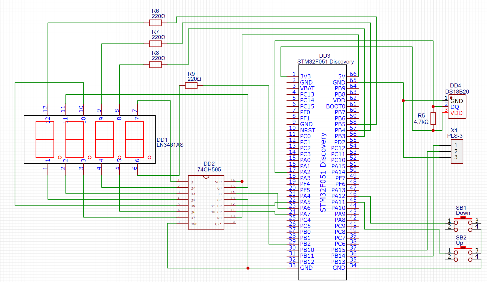
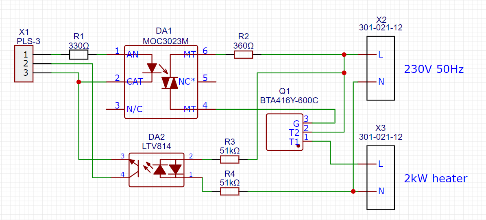
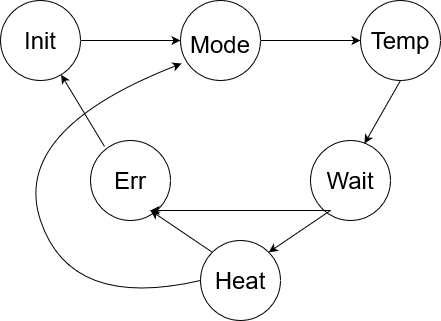

# Thermopot
- 2kW electric kettle heater
- Temperature range 5...100°C
- Relay or PID control
- Configuration via UART

## Target 
STM32F051R8-Discovery board

## Schematic
### Control unit

### Power module

## Function
### State machine diagram
